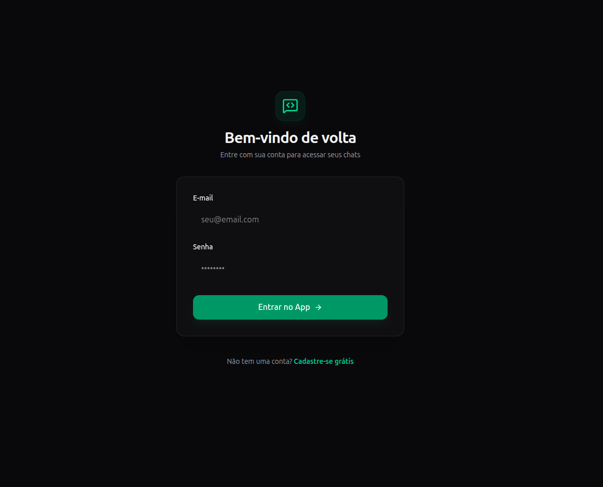
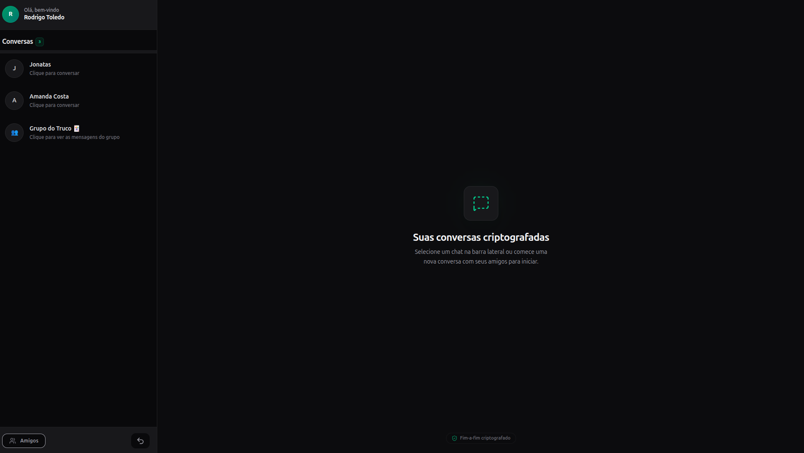
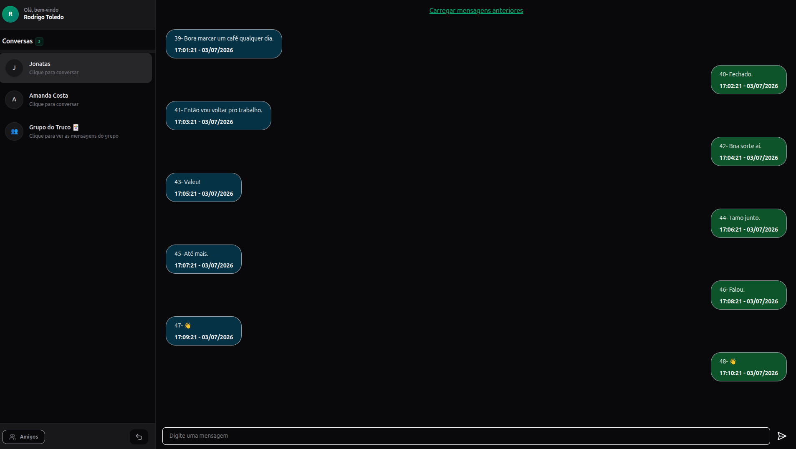
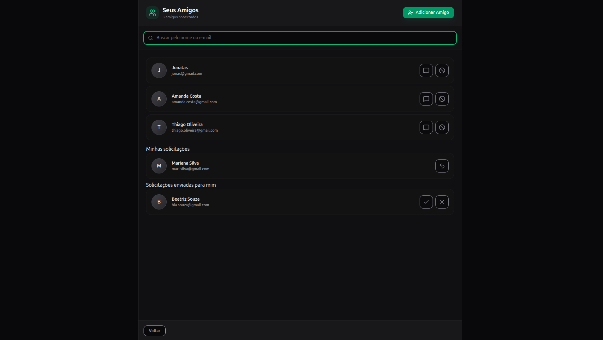
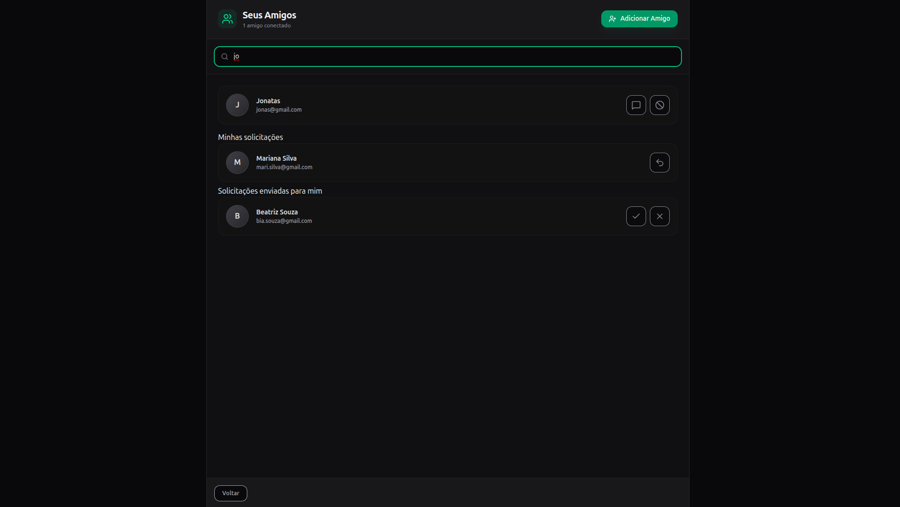
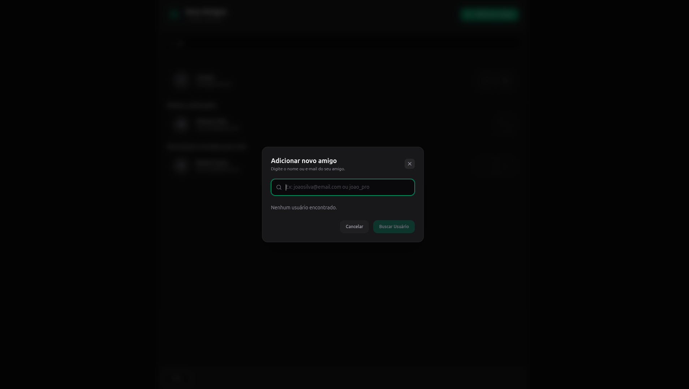
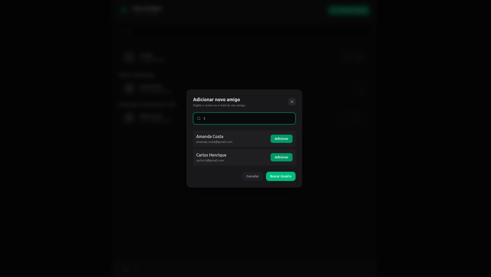

## 🚀 Como o Projeto Funciona

O **ChatApp** foi desenhado seguindo conceitos de arquitetura escalável e orientada a eventos, dividindo as responsabilidades entre microsserviços/containers dedicados:

*   **Frontend (React.js + Vite + tailwind):** Interface  rápida e reativa. Chat atualizado em tempo real e funcionalidades de adicionar, bloquear e procurar amigos.
*   **Backend (NestJS):** Centraliza a lógica de negócios, autenticação e comunicação com os bancos de dados além de gerenciar o socket.io que atualiza as mensagems em tempo real pro front end.
*   **Camada de Dados (Multi-Database):**
    *   **PostgreSQL:** Responsável pelo armazenamento de dados relacionais e estruturados, como o cadastro de usuários, perfis e configurações de segurança (gerenciado via **Prisma**).
    *   **MongoDB:** Utilizado como banco NoSQL para o armazenamento do histórico de mensagens. Por não exigir um esquema rígido e ser extremamente rápido para escrita/leitura sequencial, é ideal para logs de chat.
    *   **Redis:** Atua como a camada de cache e Message Broker (Socket.io Adapter). Ele garante que, caso o backend precise rodar em múltiplas instâncias no futuro, as mensagens via WebSockets sejam distribuídas corretamente entre todos os servidores.

---

## ✨ Funcionalidades Atuais (MVP)

*   **Comunicação em Tempo Real:** Envio e recebimento instantâneo de mensagens utilizando WebSockets (Socket.io).
*   **Persistência de Histórico:** As conversas não somem ao atualizar a página; elas são salvas no MongoDB e carregadas ao entrar no chat.
*   **Autenticação e Usuários:** Gerenciamento de sessão de usuários com dados armazenados de forma segura no PostgreSQL. Fluxo de login e refresh token.
*   **Ambiente Isolado (Docker):** Inicialização rápida de toda a infraestrutura de banco de dados e mensageria com apenas um comando.
*   **Dados Iniciais (Seeding):** Script pronto para popular o banco de dados relacional com usuários de teste facilitando o desenvolvimento.

**Login**

**Home**

**Friends**

**Add Friends**

